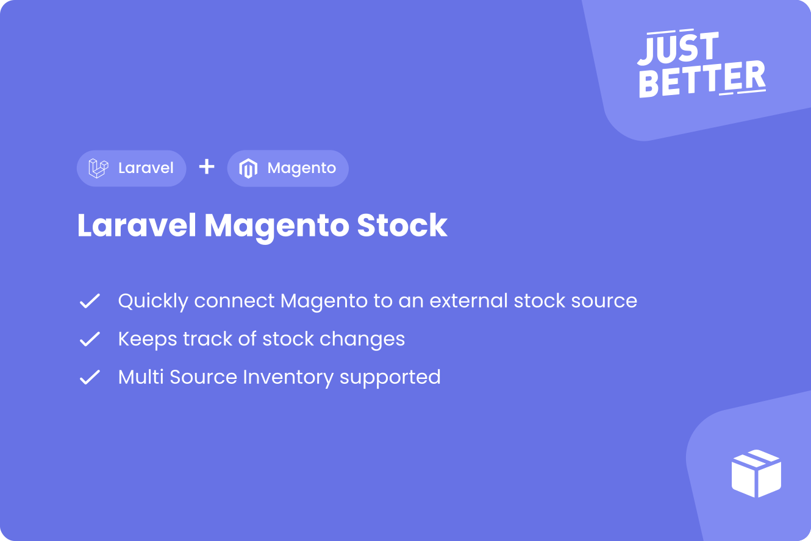

<a href="https://github.com/justbetter/laravel-magento-stock" title="JustBetter">
    
</a>

# Laravel Magento Stock

<p>
    <a href="https://github.com/justbetter/laravel-magento-stock"></a>
    <a href="https://github.com/justbetter/laravel-magento-stock"></a>
    <a href="https://github.com/justbetter/laravel-magento-stock"></a>
    <a href="https://github.com/justbetter/laravel-magento-stock"></a>
</p>

This packages facilitates a way to push stock to Magento from a configurable source.
Both simple stock and MSI are supported.

## Features

This package provides all the logic of pushing stock to Magento. It only requires an implementation for retrieving the stock.

Features:

- Retrieve stock from any source
- MSI support
- Only update stock when there are modifications
- Automatically stop syncing when there are too many errors (configurable)
- Compare stock between Magento and this package
- Supports Magento 2 async bulk requests for updating stock using [Laravel Magento Async](https://github.com/justbetter/laravel-magento-async)
- Logs activities using [Spatie activitylog](https://github.com/spatie/laravel-activitylog)
- Checks if Magento products exist using [JustBetter Magento Products](https://github.com/justbetter/laravel-magento-products)

> Also check out our other [Laravel Magento packages)(https://github.com/justbetter?q=laravel-magento)!
> We also have a [Magento Client](https://github.com/justbetter/laravel-magento-client) to easily connect Laravel to Magento!

## Installation

Require this package: `composer require justbetter/laravel-magento-stock`

Publish the config

```
php artisan vendor:publish --provider="JustBetter\MagentoStock\ServiceProvider" --tag="config"
```

Publish the activity log's migrations:

```
php artisan vendor:publish --provider="Spatie\Activitylog\ActivitylogServiceProvider" --tag="activitylog-migrations"
```

Run migrations.

```
php artisan migrate
```

> **_TIP:_** All actions in this package are run via jobs, we recommend Laravel Horizon or another queueing system to
> run these

Add the following commands to your scheduler.
```php
    protected function schedule(Schedule $schedule): void
    {
       // Process stocks marked for retrieval / update
       $schedule->command(\JustBetter\MagentoStock\Commands\ProcessStocksCommand::class)->everyMinute();

       // Retrieve all stock daily
       $schedule->job(\JustBetter\MagentoStock\Commands\Retrieval\RetrieveAllStockCommand::class)->dailyAt('05:00');

       // Retrieve modified stock every fifteen minutes, with a small overlap
       $schedule->job(\JustBetter\MagentoStock\Commands\Retrieval\RetrieveAllStockCommand::class, ['from' => 'now -1 hour'])->everyFifteenMinutes();
    }
```


### Laravel Nova

We have a [Laravel Nova integration](https://github.com/justbetter/laravel-magento-stock-nova) for this package.

## Setup

This package requires you to implement a stock repository which is responsible for retrieving stock.


### Retrieving stock

Implement the `retrieve` method and return a `StockData` object that contains the stock fields.

```php
<?php

namespace App\Integrations\MagentoStock;

use JustBetter\MagentoStock\Repositories\Repository;
use JustBetter\MagentoStock\Data\StockData;
use JustBetter\MagentoStock\Enums\Backorders;

class MyStockRepository implements Repository
{
    public function retrieve(string $sku): ?StockData
    {
        // Retrieve stock from your source

        return StockData::of([
            'sku' => $sku,
            'quantity' => 10,
            'in_stock' => true,
            'backorders' => Backorders::BackordersNotify,
        ]);
    }
}
```

### Retrieving SKU's

By default the `Repository` that you are extending will retrieve the SKU's from [justbetter/laravel-magento-products](https://github.com/justbetter/laravel-magento-products).
If you wish to use this you have to add the commands to your scheduler to automatically import products.

If you have another source for your SKU's you may implement the `skus` method yourself.
It accepts an optional carbon instance to only retrieve modified stock.

```php
<?php

namespace App\Integrations\MagentoStock;

use JustBetter\MagentoStock\Repositories\Repository;
use Illuminate\Support\Carbon;
use Illuminate\Support\Collection;

class MyStockRepository implements Repository
{
    public function skus(?Carbon $from = null): ?Collection
    {
        return collect(['sku_1', 'sku_2']);
    }
}
```

### Configuring the repository

The repository class has a couple of settings that you can adjust:

```php
class BaseRepository
{
    protected string $name = 'Repository';

    // How many stocks may be retrieved at once when the process job runs
    protected int $retrieveLimit = 250;

    // How many stocks may be updated at once when the process job runs
    protected int $updateLimit = 250;

    // How many times an update to Magento may fail before it stops trying
    protected int $failLimit = 3;

    // If MSI is enabled
    protected bool $msi = false;

    // Enable if the package should update backorders
    protected bool $backorders = false;
}
```

After you've created and configured the repository you have to set it in your configuration file:

```php
<?php

return [
    'repository' => \App\Integrations\MagentoStock\MyStockRepository::class,
];

```

### Usage

To retrieve stock you can use the following commands.

#### Processing stocks that are marked for retrieval/update

`php artisan magento-stock:process`

Each stock record has two flags, `retrieve` and `update`.
This command will dispatch the jobs to run those actions.
It is primarily used for updates, but you can implement the retrieve flag in your application to slow down retrievals.

#### Retrieving stock for a single SKU

`php artisan magento-stock:retrieve {sku}`

This will directly pass the SKU to your repository and process the result.
If the stock has been modified it will set the update flag.


#### Retrieving stock for all or modified SKU's

`php artisan magento-stock:retrieve-all {from?}`

This will call the `skus` method on your repository and dispatch retrieval jobs for all the SKU's that are returned from your repository.

#### Updating stock for a single SKU

`php artisan magento-stock:update {sku}`

#### Updating all stock

`php artisan magento-stock:update-all`

#### Comparing stock

`php artisan magento-stock:compare`

This will compare the stock in Magento and the database table. If it differs it will force an update to Magento.

### Magento MSI

If you have Magento MSI enabled you have to return the quantity and status of each source in the repository.

> **_NOTE:_**  Be sure to set the `msi` setting in the repository to `true`!

For example:

```php
<?php

namespace App\Integrations\MagentoStock;

use JustBetter\MagentoStock\Repositories\Repository;
use JustBetter\MagentoStock\Data\StockData;
use JustBetter\MagentoStock\Enums\Backorders;

class MyStockRepository implements Repository
{
    public function retrieve(string $sku): ?StockData
    {
        return StockData::of([
            'sku' => $sku,
            'backorders' => Backorders::BackordersNotify,
            'msi_status' => [
                'A' => true, // Source A is in stock
                'B' => false, // Source B is out of stock
            ],
            'msi_quantity' => [
                'A' => 10, // Source A has qty of 10
                'B' => 0, // Source B has qty of 0
            ],
        ]);
    }
}
```


## Comparisons

> This feature requires job batching

This package provides a way to compare stock quantities in Magento with those in the Laravel database.
If a difference is detected it will start an update for that product.

An event is dispatched when a difference is detected `\JustBetter\MagentoStock\Events\DifferenceDetectedEvent`.

## Handling failures

When an update fails it will try again. A fail counter is stored with the model which is increased at each failure.
In the repository you can specify how many times the update may be attempted.
You can restart the updates for a product by setting the `sync` field in the DB to true.

## Quality

To ensure the quality of this package, run the following command:

```shell
composer quality
```

This will execute three tasks:

1. Makes sure all tests are passed
2. Checks for any issues using static code analysis
3. Checks if the code is correctly formatted

## Contributing

Please see [CONTRIBUTING](.github/CONTRIBUTING.md) for details.

## Security Vulnerabilities

Please review [our security policy](../../security/policy) on how to report security vulnerabilities.

## Credits

- [Vincent Boon](https://github.com/VincentBean)
- [All Contributors](../../contributors)

## License

The MIT License (MIT). Please see [License File](LICENSE) for more information.

<a href="https://justbetter.nl" title="JustBetter">
    
</a>
